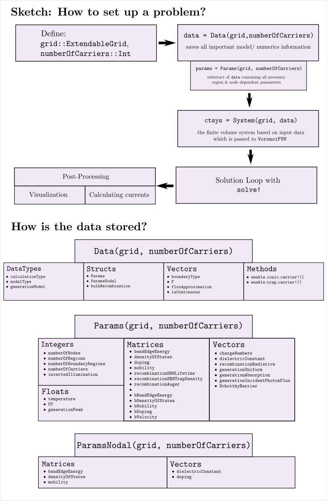

# [General Information on Code Structure] (@id generalDescription)

The following flow charts should give an impression how own examples can be build. The crucial information on the model which shall be simulated is stored within the Data struct.

