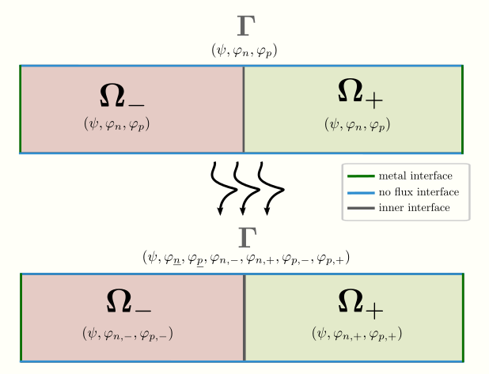

[Interface Species] (@id interfaceSpecies)
================================

With help of `ChargeTransport.jl` you have the possibility to likewise simulate present electric
interface charge carriers at the internal boundaries.

In the following, we introduce briefly the main code snippets along with the underlying continuous
charge transport model. We will illustrate this feature on the basis of the standard van Roosbroeck system.

Let $\mathbf{\Omega} \subseteq \mathbb{R}^d$,
$d \leq 3$, be an open, connected and bounded spatial domain divided into to approriate subspaces $\mathbf{\Omega}_{-}, \mathbf{\Omega}_{+} $, corresponding to the layers of a p-n device.
We denote the non-empty interface with codimension $1$ between both subdomains by
$\mathbf{\Gamma} = \partial \mathbf{\Omega}_{-} \cap \partial \mathbf{\Omega}_{+}$.
The model with $(\psi, \varphi_n, \varphi_p)$ as unknowns is given by

```math
\begin{aligned}
	- \nabla \cdot (\varepsilon_s \nabla \psi) &= q \Big( C + z_p n_p(\psi, \varphi_p) + z_n n_n(\psi, \varphi_n) \Big),\\
	z_n q \partial_t n_n(\psi, \varphi_n) + \nabla \cdot \mathbf{j}_n &= - z_nqR(n_n,n_p), \\
	z_p q \partial_t n_p(\psi, \varphi_p) + \nabla \cdot \mathbf{j}_p &= - z_p qR(n_n,n_p).
\end{aligned}
```
In most applications following interface conditions for $\mathbf{x} \in \mathbf{\Gamma}$ are imposed

1. Continuity of
    1. quasi Fermi potentials
    2. electric potential
2. Conservation of
    1. electric current densities
    2. electric displacement flux

Now, we discuss the case, the case of present interface charge carriers. Thus, some (DA: which??) of the previously mentioned conditions are not satisfied anymore.




Implementation
================================


Note that, it is important to identify within your grid that the interface is an actual internal boundary.

```julia
bregActive = 3

bfacemask!(grid, [h_ndoping], [h_ndoping + h_pdoping], bregActive)

```
Otherwise, you will run into issues.


Enable the interface carrier. For this, we need information on the index of interface carrier, corresponding bulk carrier and active interface region

```julia
enable_interface_carrier!(data, bulkCarrier = iphin,
                          interfaceCarrier = iphinb,
                          bregions = [bregActive])
enable_interface_carrier!(data, bulkCarrier = iphip,
                          interfaceCarrier = iphipb,
                          bregions = [bregActive])
```

User likewise needs to add reaction rate
**TO DO: change the name to bReactionRate and add the reaction rate for interface species likewise to main file**

Further, we introduce the reactions rates for the discontinuity.

```julia
params.bReactionRate[iphin, bregionJunction]     = 1.0e15 / (m^2 * s)
params.bReactionRate[iphip, bregionJunction]     = 1.0e15 / (m^2 * s)
```

The larger these values, the more continuity can be observed.


INTERNALLY:
discontqF type is chosen.


Additional Information:
We can likewise use surface reco for this case

```julia
data.boundaryType[bregionJunction] = InterfaceModelSurfaceReco # InterfaceModelNone
```

How to infer other possible surface effects is explaines in DeveloperSide.md ...


Visualization of effects
================================

**Some issues with VoronoiFVM.jl and ExtendableGrids.jl which need to be fixed.**
